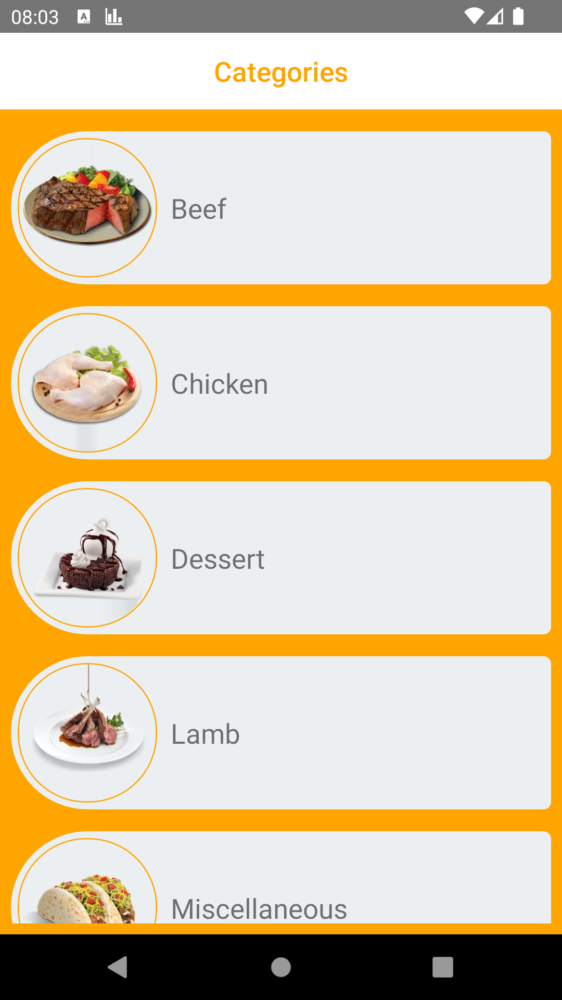
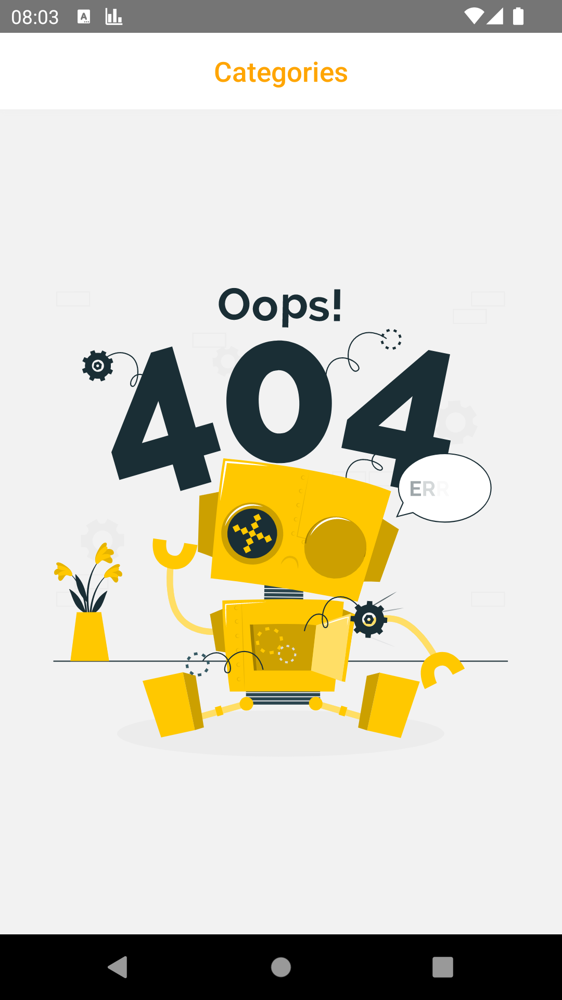
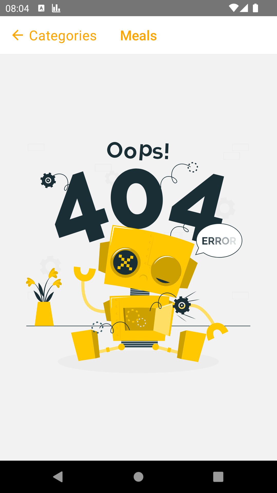
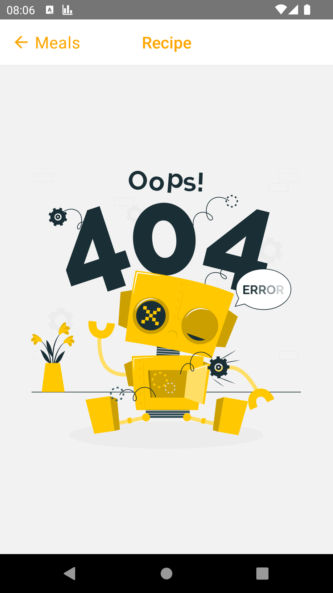

# React Native Patika Tarifka App

The project is a mobile application that lists food categories and their details. The project is developed using React Native. The project uses the mealdb API to fetch data. The project is developed as a part of the Patika.dev React Native course.


## Structures used:
- LottiView with loading/error animation
- Data fetching, parsing from web api with Axios
- Listing data with FlatList and custom components
- Using custom hook useFetch for data fetching operations
- Using FastImage library (Image alternative, cache/fast render)
- React Navigation, Stack Navigator for navigation
- Manipulation of page titles
- Color management with custom color file
- Managing sensitive variables with .env using react-native-config
- Linking usage; Redirecting to the video with Youtube video url
- Absolute positioning application on the Meals page
- Using the SafeAreaView component for safe area management


## Features
- List all meal categories
- List all meals in selected category
- Filter meals by category, area, main ingredient
- Show recepie of the selected meal
- Show video and image of the selected meal


## Screenshots












## Installation

To run the Todo app on your local machine, you need to have Node.js and npm installed. You also need to have an Android or iOS emulator installed on your computer or a physical device connected to your computer. Follow these steps to install and run the application:

1. Clone the repository:

   ```bash
   git clone https://github.com/yusufie/react-native-patika-tarifka.git
    ```

2. Navigate to the project directory:

   ```bash
   cd react-native-patika-tarifka
   ```

3. Install the dependencies:

   ```bash
    npm install
    ```

4. Run the development server:

   ```bash
   npm run start
   ```

6. Run the application on an emulator or a physical device:

   ```bash
   npm run android
   ```

   or

   ```bash
   npm run ios
   ```

Open the emulator or connect your physical device to your computer to run the application. The application will be automatically installed and launched on the device.


## Contributing

Contributions are welcome! If you find any issues or have suggestions for improvements, please open an issue or submit a pull request. Follow these steps to contribute:

1. Fork the repository.
2. Create a new branch for your feature or bug fix.
3. Make the necessary changes and commit those changes.
4. Push your code to your forked repository.
5. Submit a pull request describing the changes you made.

Please make sure to follow the existing code style and conventions.
